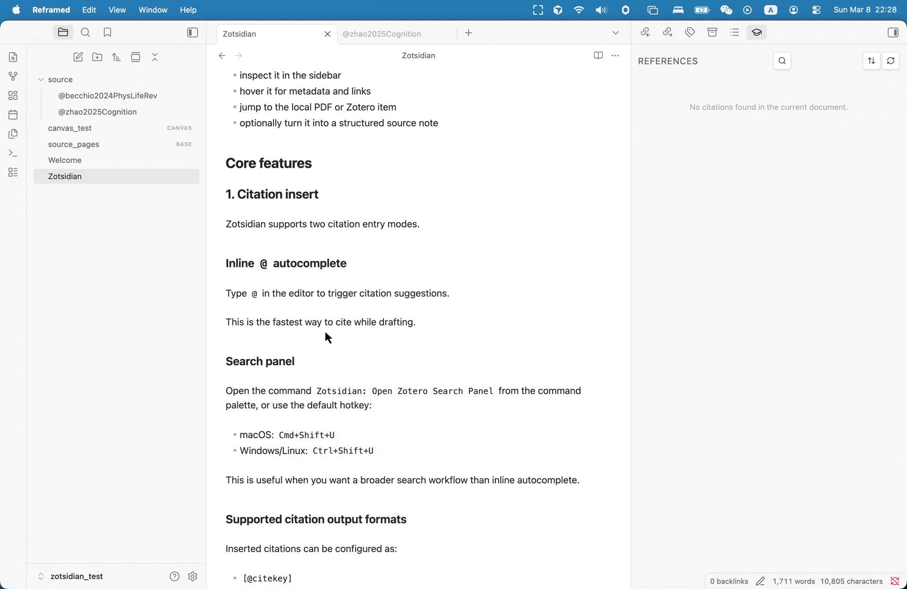
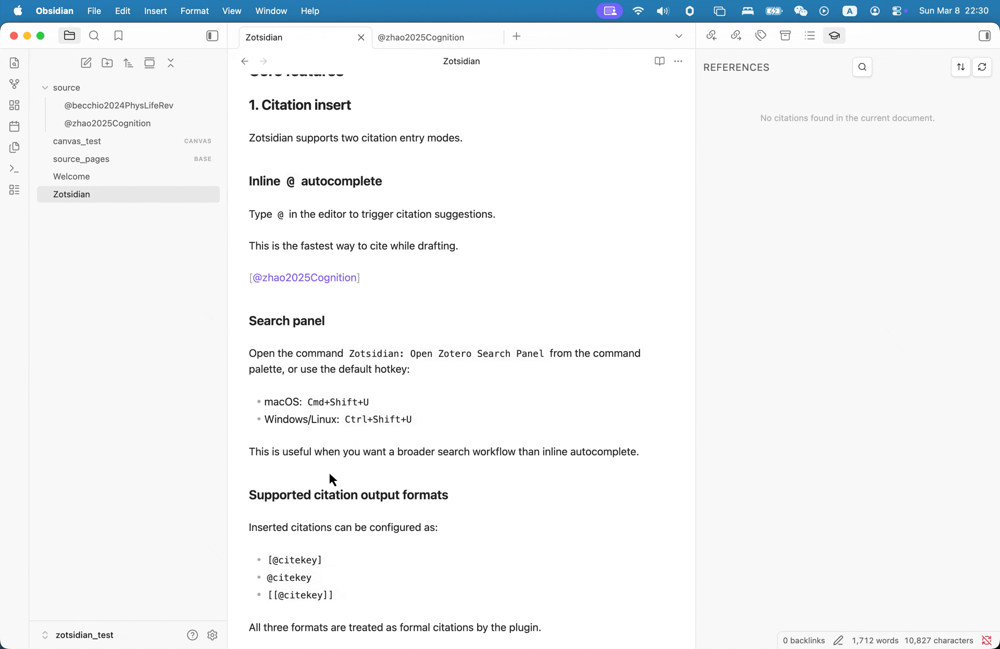
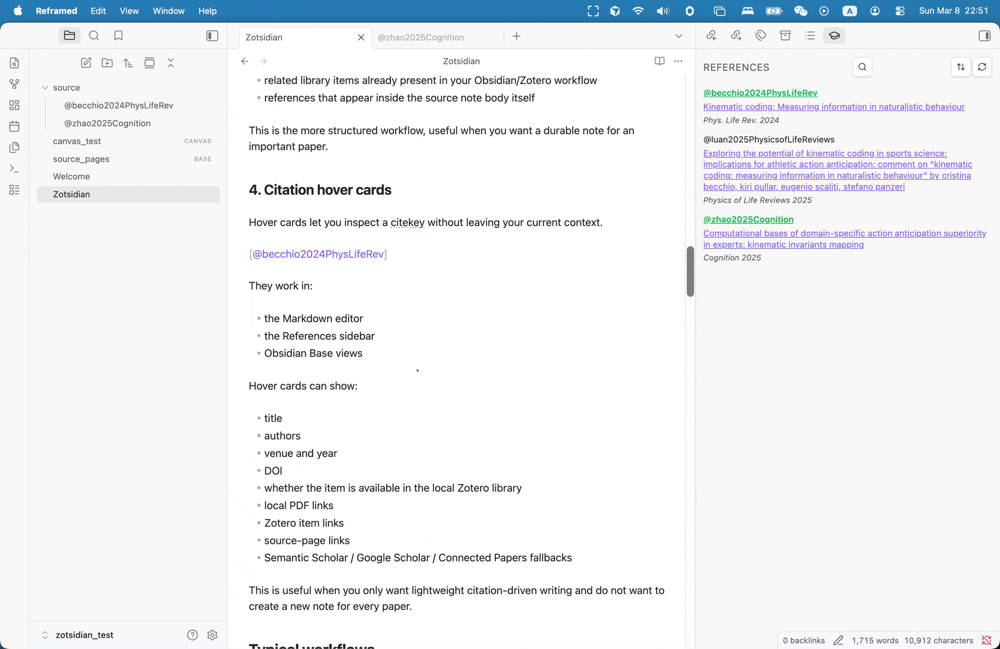

# Zotsidian

Zotsidian is an Obsidian desktop plugin for Zotero(Zotero 8)-first writing and literature management. Zotsidian is primarily inspired by [zotero-roam](https://github.com/alixlahuec/zotero-roam) by Alix Lahuec, which is most amazing zotero extension I have ever used. Unfortunately, it seems no longer maintained and not compatible with the Obsidian and the latest Zotero versions. So I (let AI, i.e., Codex with GPT-5.4) made this extension.

It is built around four core capabilities:

1. Citation insert
   - insert citations with inline `@` autocomplete
   - insert citations from a dedicated search panel
2. References sidebar
   - show the reference information for the citations used in the current page
3. Source page sidebar
   - when the current note is a paper note like `@citekey`, show that paper's metadata, references, citations, and related library items
4. Citation hover cards
   - hover a citekey to preview metadata and jump directly to a local PDF or Zotero item

The plugin is designed for two writing styles:

- a lightweight style, where you mainly write in normal notes and use citations directly
- a source-page style, where some or all papers also get their own `@citekey` notes

## Core features

### 1. Citation insert

Zotsidian supports two citation entry modes.

#### Inline `@` autocomplete

Type `@` in the editor to trigger citation suggestions.

This is the fastest way to cite while drafting.



#### Search panel

Open the command `Zotsidian: Open Zotero Search Panel` from the command palette, or use the default hotkey:

- macOS: `Cmd+Shift+U`
- Windows/Linux: `Ctrl+Shift+U`

This is useful when you want a broader search workflow than inline autocomplete.



#### Supported citation output formats

Inserted citations can be configured as:

- `[@citekey]`
- `@citekey`
- `[[@citekey]]`

All three formats are treated as formal citations by the plugin.

### 2. References sidebar

For normal notes, the right sidebar shows the reference information for the citations found in the current page.

This means you can keep writing in the main editor while inspecting references in parallel.

The References sidebar supports:

- references extracted from the active Markdown note, Obsidian Base view, Obsidian canvas
- direct links to PDF, Zotero, and source page
- sorting by:
  - insertion order
  - year, newest first
  - author + year

This is particularly useful for article drafting, thesis writing, and literature review notes.


### 3. Source page sidebar

A source page is a note named `@citekey`.

When the active note is a source page, the right sidebar switches to a source-oriented view and can show:

- Zotero metadata
- attachment links
- external links such as Zotero, Semantic Scholar, Google Scholar, and Connected Papers
- references of the current paper
- citations of the current paper
- related library items already present in your Obsidian/Zotero workflow
- references that appear inside the source note body itself

This is the more structured workflow, useful when you want a durable note for an important paper.


### 4. Citation hover cards

Hover cards let you inspect a citekey without leaving your current context.

They work in:

- the Markdown editor
- the References sidebar
- Obsidian Base views

Hover cards can show:

- title
- authors
- venue and year
- DOI
- whether the item is available in the local Zotero library
- local PDF links
- Zotero item links
- source-page links
- Semantic Scholar / Google Scholar / Connected Papers fallbacks

This is useful when you only want lightweight citation-driven writing and do not want to create a new note for every paper.



## Obsidian Base support

Zotsidian can read visible citekeys from active Base views.

That means:

- the References sidebar can work from Base pages
- hover cards can work on citation tokens shown in Base tables

This is useful when your literature workflow uses Base as a table or dashboard layer. For example, use the base to organize and filter papers to a research project.

## Defaults on a fresh install

Zotsidian defaults are intentionally conservative:

- Citation insert format: `[@citekey]`
- Create source page on citation select: off
- Load attachment links in source panel: on
- Source pages folder: `source`
- Source page template path: empty
- Related papers provider: `Auto (Recommended)`
- Search panel hotkey: `Cmd+Shift+U` / `Ctrl+Shift+U`

These defaults favor direct writing first, and source-page creation only when the user explicitly wants it.

## Do you need Better BibTeX?

### Better BibTeX plugin

In practice, usually yes.

Zotsidian needs usable citation keys to support:

- `@` citation insertion
- source pages named `@citekey`
- citation hover cards
- reference and source resolution

Zotero 8 provides a native `Citation Key` field, but it does not reliably generate or maintain citation keys for you on its own. For most users, the practical solution is to install **Better BibTeX** and let it generate and manage citation keys in Zotero.

If you already maintain valid citation keys by some other method, Zotsidian can use them. But for most real workflows, Better BibTeX should be treated as a practical requirement.

### Better BibTeX JSON export

No, this is not required for the main workflow.

The primary Zotsidian workflow is based on Zotero Desktop 8 and live local lookup.

`Local JSON fallback path` is only an advanced fallback when live Zotero lookup is incomplete.

Most users should not need a JSON export.

## Related papers and external providers

For source pages with a DOI or a usable title, Zotsidian can fetch:

- references
- citations
- related library items already present in your Zotero-backed note system

Provider modes:

- `Auto (Recommended)`
- `Semantic Scholar only`
- `OpenAlex only`

Recommended mode tries Semantic Scholar first and falls back to OpenAlex when Semantic Scholar is rate-limited or incomplete.

## Requirements

### Required

- Obsidian `>= 1.10.6`
- Obsidian desktop on macOS, Windows, or Linux
- Zotero Desktop 8 installed on the same computer
- usable citation keys on the Zotero items you want to cite

### Required for the full local workflow

Zotsidian is designed around live local resolution against Zotero Desktop. For citation lookup, hover cards, PDF opening, Zotero item opening, and source-page enrichment to work reliably:

- Zotero Desktop should be running while you use Obsidian
- your cited items should exist in the local Zotero library you want to query
- Zotero local API access should be available on the local machine

For most users, this also means:

- Better BibTeX should be installed so citation keys are generated and maintained consistently

If Zotero Desktop is closed, some local-library features will degrade or stop working, especially:

- live citation resolution
- opening local PDFs
- opening Zotero items
- attachment discovery in the source sidebar

### Optional but recommended

- PDF attachments stored in Zotero, if you want `Open PDF` actions to work
- DOI or at least a usable title on a source item, if you want related references/citations to resolve well
- internet access for:
  - Semantic Scholar / OpenAlex related-paper lookup
  - Connected Papers
  - Google Scholar

### Optional advanced fallback

- a Better BibTeX JSON export file, only if you want a fallback index source when live Zotero lookup is incomplete

You usually do need citation keys, and Better BibTeX is the normal way to get them reliably.

You do not need a Better BibTeX JSON export for the primary Zotero 8 workflow.

## Installation

### Install from GitHub Release

This is the recommended installation method before Zotsidian is available in the Obsidian community plugin browser.

1. Open the latest GitHub Release for Zotsidian
2. Download these release assets:
   - `main.js`
   - `manifest.json`
   - `styles.css`
3. Create a folder in your vault:
   - `.obsidian/plugins/zotsidian`
4. Copy the three files into that folder
5. Enable **Zotsidian** in Obsidian community plugins

### Manual installation from source

Use this if you want to modify the plugin or test the source code directly.

1. Clone the repository
2. Install dependencies:

```bash
npm install
```

3. Build the plugin:

```bash
npm run build
```

4. Create a vault plugin folder:
   - `.obsidian/plugins/zotsidian`
5. Copy these files from the repository root into that folder:
   - `main.js`
   - `manifest.json`
   - `styles.css`
6. Enable **Zotsidian** in Obsidian community plugins

## Development

If you want to develop or debug the plugin locally:

```bash
npm install
npm run dev
```

This will watch the source and rebuild `main.js` automatically.

You still need to copy the built files into your vault plugin folder, or symlink the project into `.obsidian/plugins/zotsidian` if you prefer a development setup.

## Quick start

1. Start Zotero Desktop
2. Enable Zotsidian in Obsidian
3. Make sure the Zotero items you want to cite already have usable citation keys
   - for most users, this means Better BibTeX is installed and generating citation keys
4. Check these settings:
   - `Default Zotero scope`
   - `Citation insert format`
   - `Create source page on citation select`
   - `Source pages folder`
5. Type `@` in a note and insert a citation
6. Hover the citation to open the PDF or Zotero item
7. Use the References sidebar to inspect cited papers
8. If needed, open or create an `@citekey` source page for deeper inspection

## License

MIT. See [LICENSE](./LICENSE).
