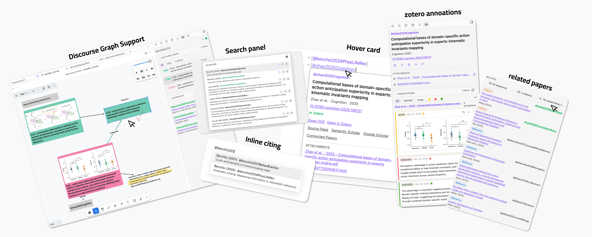
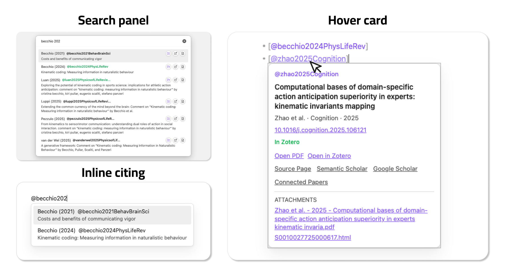
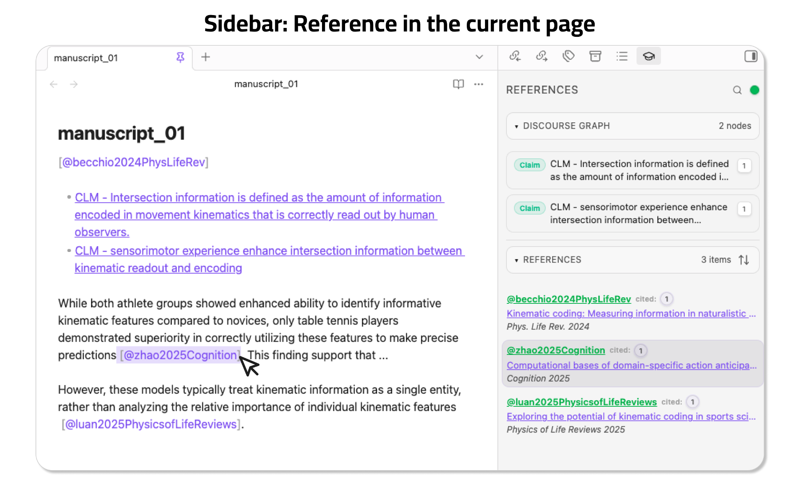
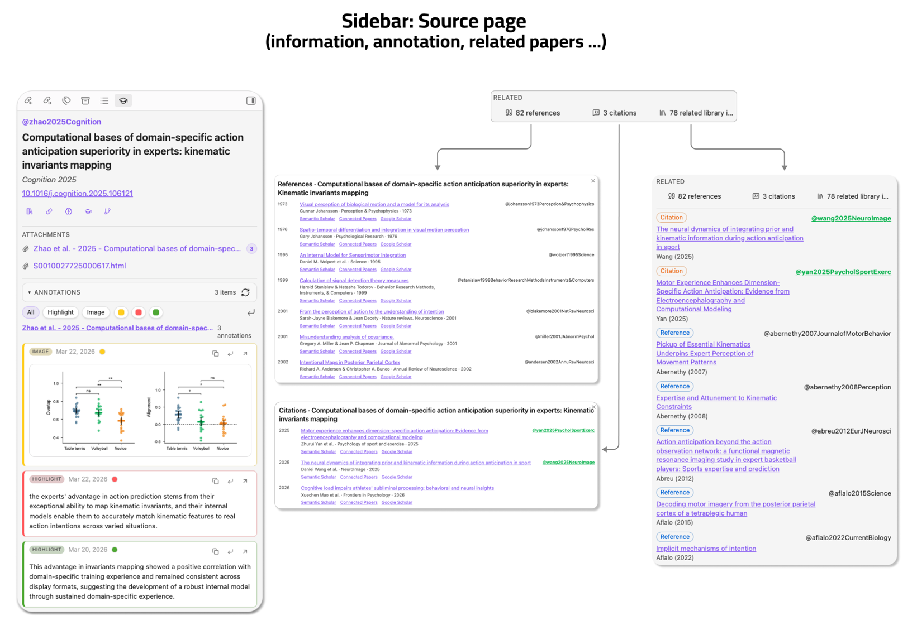
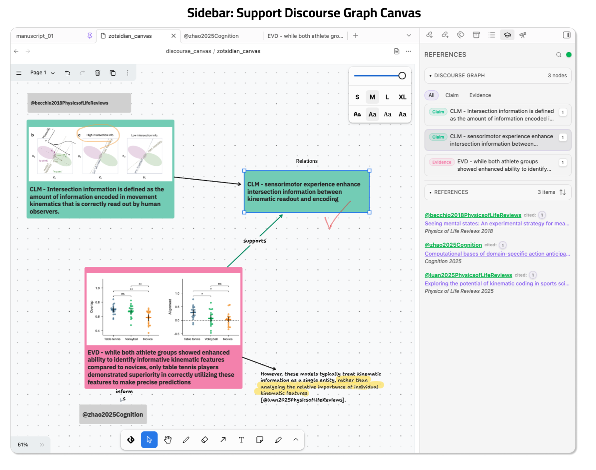

# Zotsidian

[English](./README.md) | [简体中文](./README.zh-CN.md)

Zotsidian is an Obsidian desktop extension for Zotero 8-first writing, source pages, annotations, and discourse graph workflows.

It started from a simple citation workflow idea inspired by [zotero-roam](https://github.com/alixlahuec/zotero-roam) and [obsidian-deepsit](https://github.com/bassio/obsidian-deepsit), and has grown into a more integrated Zotero-to-Obsidian workflow layer with support for [discourse-graphs](https://github.com/DiscourseGraphs/discourse-graph), built with AI-assisted development. Note: the extension has not been tested properly, please feel free to report any issues and suggestions.



## Highlights

Zotsidian is built around five practical capabilities:


1. Citation workflow
   - insert citations with inline `@` autocomplete
   - search Zotero from a dedicated panel
   - inspect citekeys with hover cards
3. References sidebar
   - inspect the references used in the active note without leaving the page
   - sort and focus citations while writing
4. Source page workspace
   - treat `@citekey` notes as paper dashboards
   - view metadata, attachments, related items, discourse nodes, and references together
5. Zotero annotations
   - filter, copy, open, and insert highlights or images directly into your notes
5. Discourse graph canvas support
   - integrate with `discourse-graphs` canvas
   - detect source nodes, citation text, and discourse nodes
   - highlight sidebar items from canvas selections
   - jump back from sidebar targets into canvas

## Core Features

### 1. Citation Insert and Hover Cards

Zotsidian supports two citation entry modes:

- inline `@` autocomplete inside the editor
- a dedicated Zotero search panel

Hover cards let you inspect a citekey without leaving your current context. They work especially well for lightweight writing when you want citation lookup without opening a source page.

Inserted citations can be configured as:

- `[@citekey]`
- `@citekey`
- `[[@citekey]]`

All three formats are treated as formal citations by the plugin.



### 2. References Sidebar

For normal notes, the right sidebar shows the references used in the active page.

This supports a writing-first workflow: keep drafting in the main editor while inspecting references, sorting them, and jumping to cited occurrences in parallel.

The References sidebar supports:

- Normal obsidian notes
- obsidian base
- discourse-graphs canvas
- native Obsidian canvas

Sorting modes:
- insertion order
- year, newest first
- author + year

Highlight the current input line's citation in the sidebar. Clicking the number buttion in the sidebar, jump back to the citaiton line. Discouse graph nodes supported as well.



### 3. Source Page Workspace

A source page is a note named `@citekey`.

When the active note is a source page, the sidebar becomes a paper workspace and can show:

- Zotero metadata
- attachment links
- external links such as Zotero, Semantic Scholar, Google Scholar, and Connected Papers
- filtered Zotero annotations
- insert / copy / open actions for annotations with one click
- references of the current paper
- citations of the current paper
- related library items already present in your Obsidian / Zotero workflow
- discourse graph nodes detected in the note body



### 4. Discourse Graph Canvas Support

Zotsidian has dedicated support for the [discourse-graphs](https://github.com/DiscourseGraphs/discourse-graph) Obsidian plugin.

On discourse canvas pages, the sidebar can detect:

- source nodes such as `@citekey`
- discourse nodes such as claim / evidence / question / source
- citation text shapes

It supports:

- sidebar highlighting from canvas selection
- reverse jump from sidebar occurrence buttons back into canvas
- discourse node type filtering inside the sidebar

This is currently the strongest graph workflow in the plugin and one of the main differentiators of Zotsidian.



## Lightweight Native Base and Canvas Support

Zotsidian also provides lightweight support for native Obsidian Base and native Canvas.

That means:

- reference extraction can work from those pages
- citation hover cards can still be useful in lightweight workflows

This support is intentionally simpler than the discourse-graphs integration. The full bidirectional graph workflow is designed for discourse-graphs canvas, not native Canvas.

## Related Papers and External Providers

For source pages with a DOI or a usable title, Zotsidian can fetch:

- references
- citations
- related library items already present in your Zotero-backed note system

Provider modes:

- `Auto (Recommended)`
- `Semantic Scholar only`
- `OpenAlex only`

Recommended mode tries Semantic Scholar first and falls back to OpenAlex when Semantic Scholar is rate-limited or incomplete.

## Do You Need Better BibTeX?

### Better BibTeX plugin

In practice, usually yes.

Zotsidian needs usable citation keys to support:

- `@` citation insertion
- source pages named `@citekey`
- citation hover cards
- reference and source resolution

Zotero 8 provides a native `Citation Key` field, but it does not reliably generate or maintain citation keys for you on its own. For most users, the practical solution is to install **Better BibTeX** and let it generate and manage citation keys in Zotero.

If you already maintain valid citation keys by some other method, Zotsidian can use them. But for most real workflows, Better BibTeX should be treated as a practical requirement.

## Defaults on a Fresh Install

Zotsidian defaults are intentionally conservative:

- Citation insert format: `[@citekey]`
- Create source page on citation select: off
- Load attachment links in source panel: on
- Source pages folder: `source`
- Source page template path: empty
- Related papers provider: `Auto (Recommended)`
- Search panel hotkey: `Cmd+Shift+U` / `Ctrl+Shift+U`

These defaults favor direct writing first, and source-page creation only when the user explicitly wants it.

## Requirements

### Required

- Obsidian `>= 1.10.6`
- Obsidian desktop on macOS, Windows, or Linux
- Zotero Desktop 8 installed on the same computer
- usable citation keys on the Zotero items you want to cite

### Required for the full local workflow

Zotsidian is designed around live local resolution against Zotero Desktop. For citation lookup, hover cards, PDF opening, Zotero item opening, source-page enrichment, and annotation workflows to work reliably:

- Zotero Desktop should be running while you use Obsidian
- your cited items should exist in the local Zotero library you want to query
- Zotero local API access should be available on the local machine
- in Zotero, open `Settings / Preferences -> Advanced` and enable `Allow other applications on this computer to communicate with Zotero`

For most users, this also means:

- Better BibTeX should be installed so citation keys are generated and maintained consistently

If Zotero Desktop is closed, some local-library features will degrade or stop working, especially:

- live citation resolution
- opening local PDFs
- opening Zotero items
- attachment discovery in the source sidebar
- annotation refresh and insert workflows

### Optional but recommended

- PDF attachments stored in Zotero, if you want `Open PDF` actions to work
- DOI or at least a usable title on a source item, if you want related references / citations to resolve well
- internet access for:
  - Semantic Scholar / OpenAlex related-paper lookup
  - Connected Papers
  - Google Scholar

### Optional integration

- the `discourse-graphs` Obsidian plugin, if you want discourse canvas support

### Optional advanced fallback

- a Better BibTeX JSON export file, only if you want a fallback index source when live Zotero lookup is incomplete

You usually do need citation keys, and Better BibTeX is the normal way to get them reliably.

You do not need a Better BibTeX JSON export for the primary Zotero 8 workflow.

## Installation

### Install from GitHub Release

This is the recommended installation method before Zotsidian is available in the Obsidian community plugin browser.

1. Open the latest GitHub Release for Zotsidian
2. Download these release assets:
   - `main.js`
   - `manifest.json`
   - `styles.css`
3. Create a folder in your vault:
   - `.obsidian/plugins/zotsidian`
4. Copy the three files into that folder
5. Enable **Zotsidian** in Obsidian community plugins

Important:

- In Zotero, go to `Settings / Preferences -> Advanced` and make sure `Allow other applications on this computer to communicate with Zotero` is enabled.
- If this option is off, Zotsidian may fail to load citation indexes, attachments, hover data, and annotation content.

### Manual installation from source

Use this if you want to modify the plugin or test the source code directly.

1. Clone the repository
2. Install dependencies:

```bash
npm install
```

3. Build the plugin:

```bash
npm run build
```

4. Create a vault plugin folder:
   - `.obsidian/plugins/zotsidian`
5. Copy these files from the repository root into that folder:
   - `main.js`
   - `manifest.json`
   - `styles.css`
6. Enable **Zotsidian** in Obsidian community plugins

## Development

If you want to develop or debug the plugin locally:

```bash
npm install
npm run dev
```

This will watch the source and rebuild `main.js` automatically.

You still need to copy the built files into your vault plugin folder, or symlink the project into `.obsidian/plugins/zotsidian` if you prefer a development setup.

## Quick Start

1. Start Zotero Desktop
2. In Zotero, go to `Settings / Preferences -> Advanced` and enable `Allow other applications on this computer to communicate with Zotero`
3. Enable Zotsidian in Obsidian
4. Make sure the Zotero items you want to cite already have usable citation keys
   - for most users, this means Better BibTeX is installed and generating citation keys
5. Check these settings:
   - `Default Zotero scope`
   - `Citation insert format`
   - `Create source page on citation select`
   - `Source pages folder`
6. Type `@` in a note and insert a citation
7. Hover the citation to inspect metadata or open the PDF / Zotero item
8. Use the References sidebar to inspect cited papers
9. If needed, open or create an `@citekey` source page for deeper inspection
10. If you use discourse-graphs, open a discourse canvas and let the sidebar track source nodes and discourse nodes

## License

MIT. See [LICENSE](./LICENSE).
