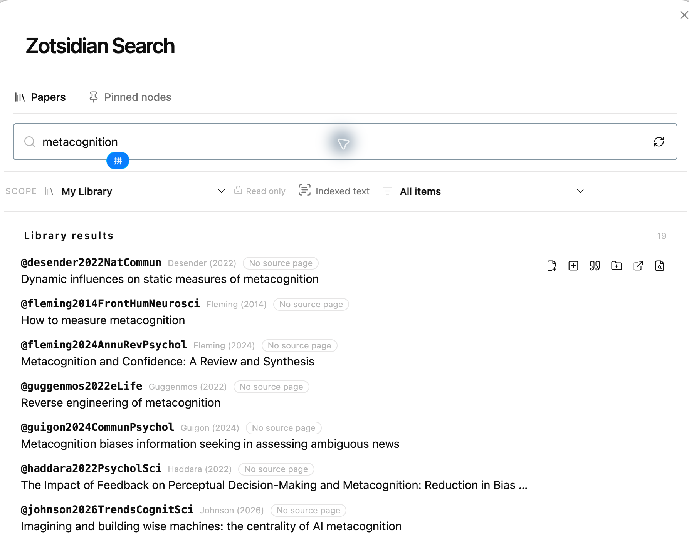
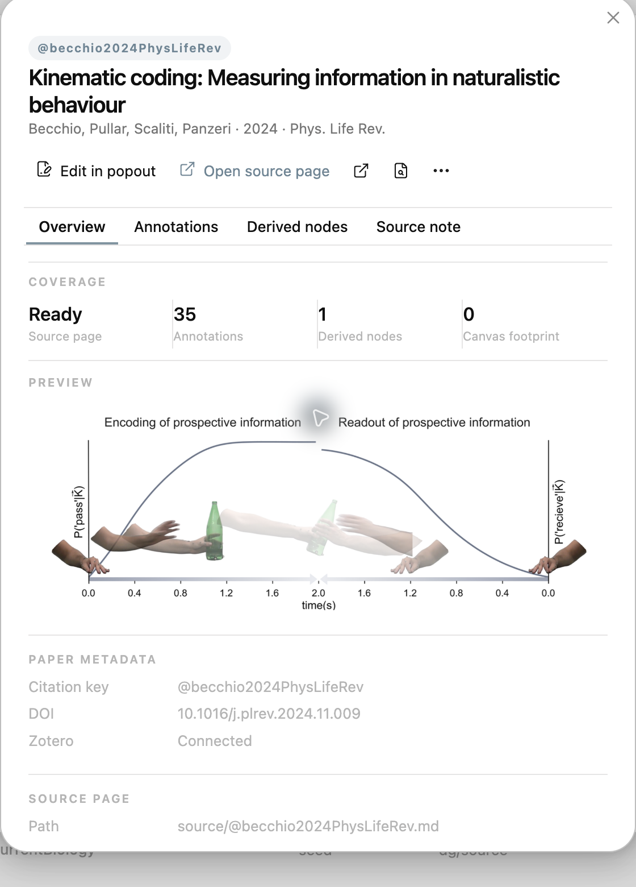
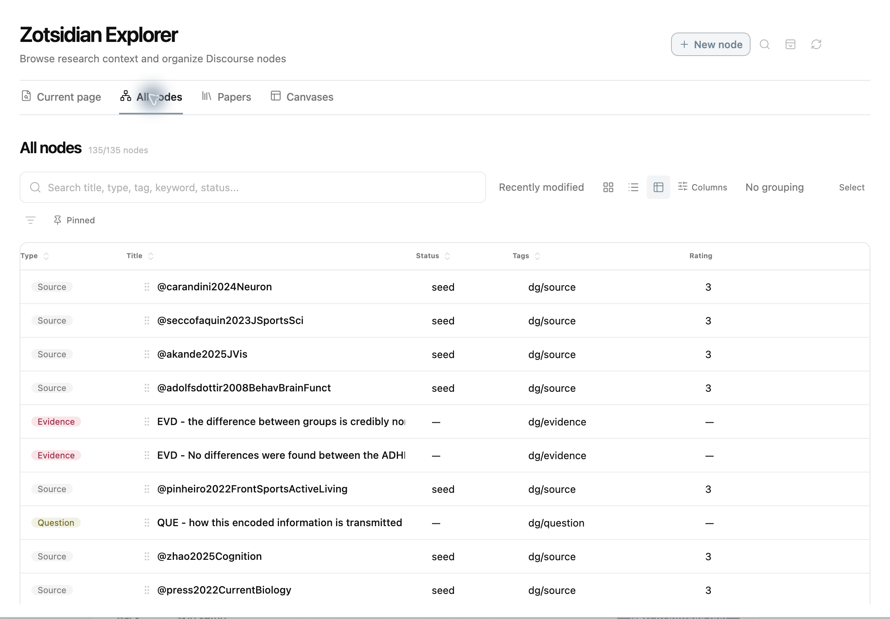
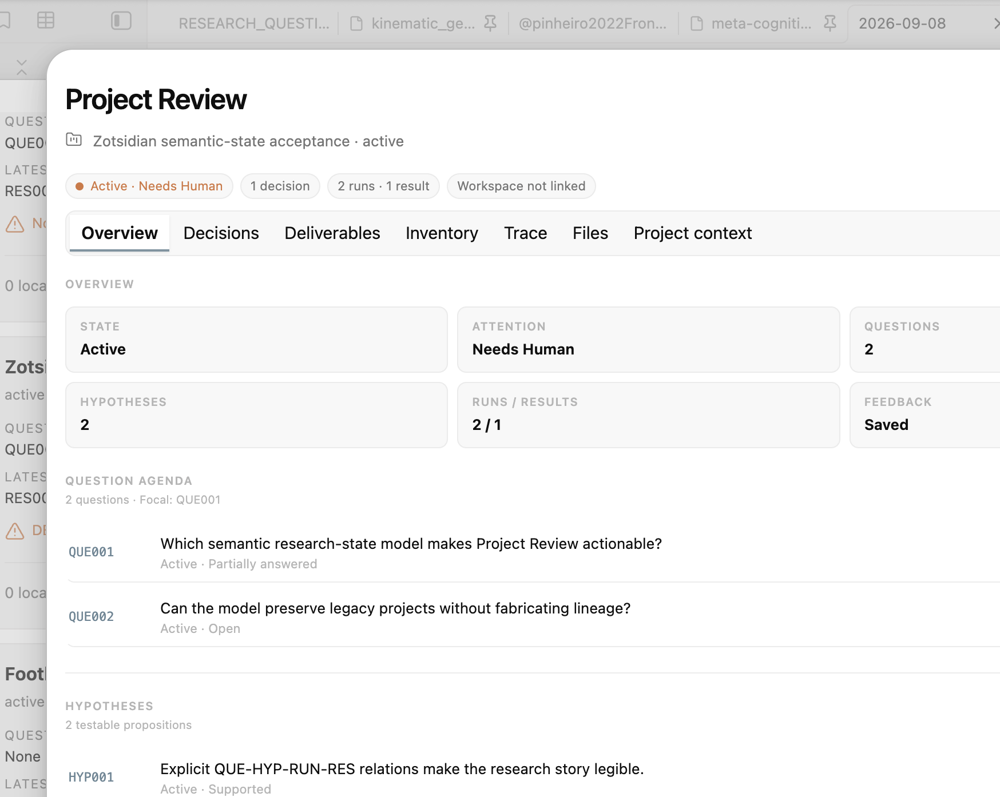
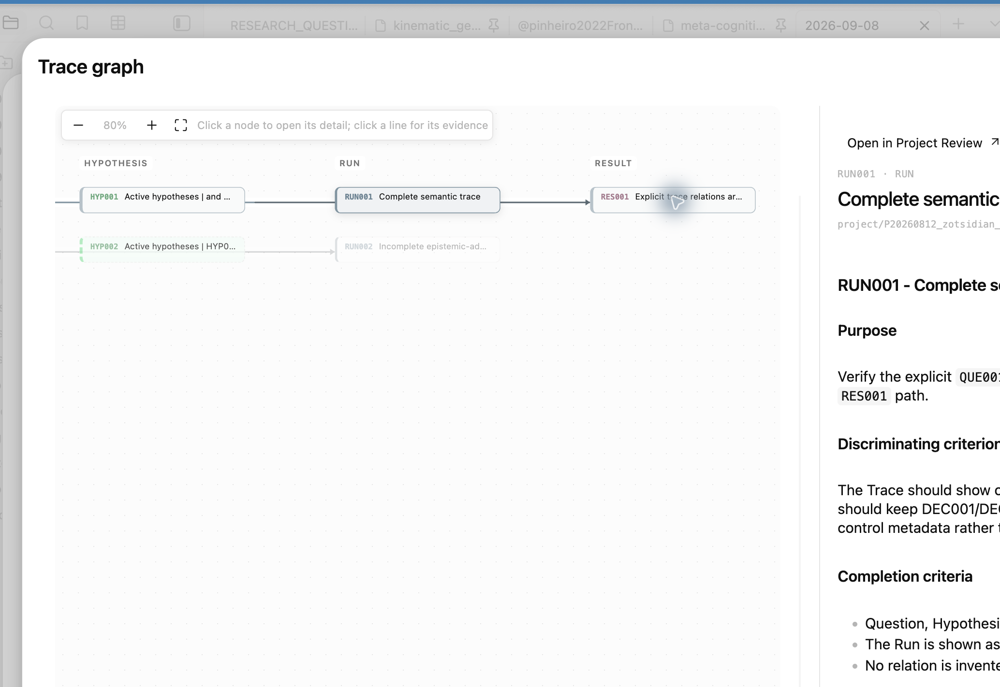
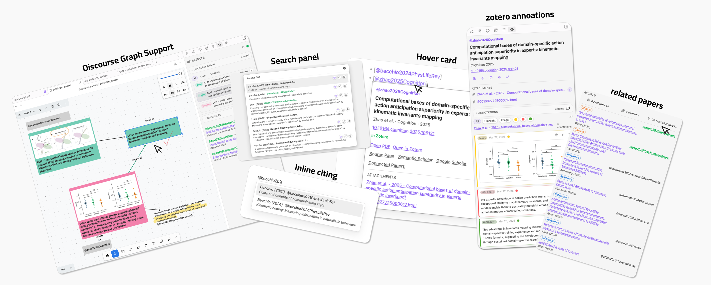
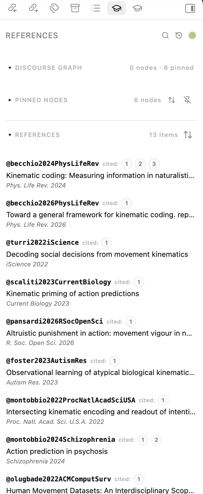
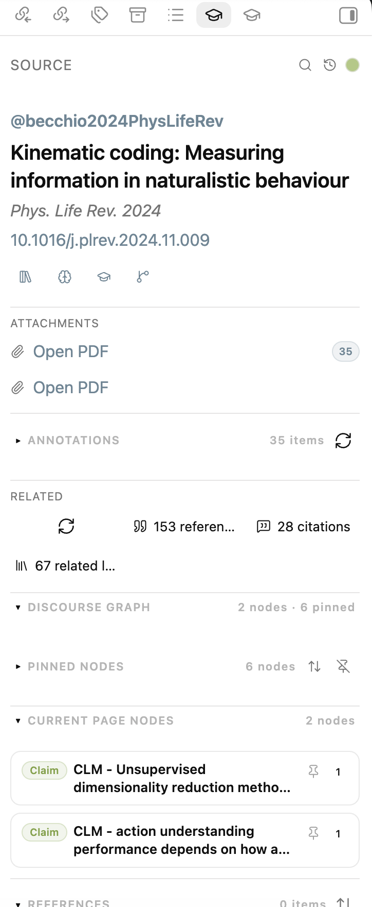
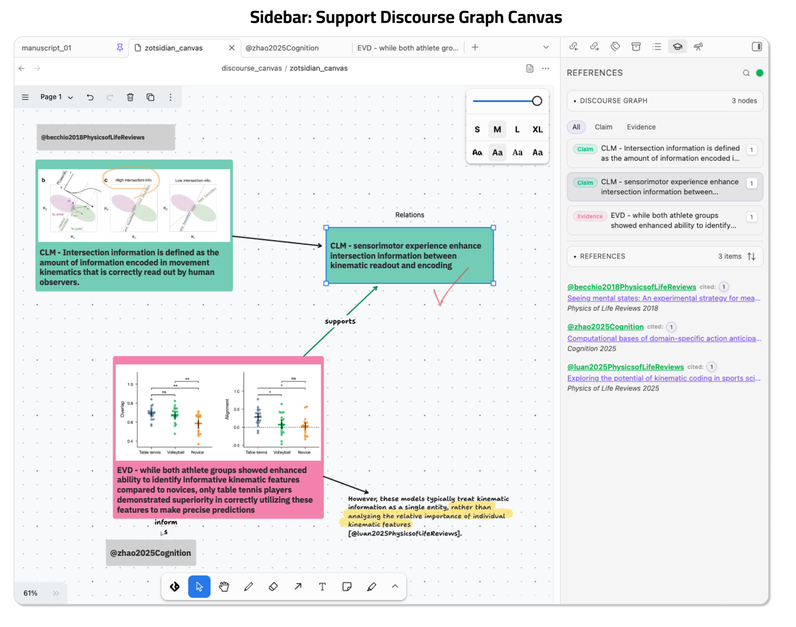

# Zotsidian

[English](./README.md) | [简体中文](./README.zh-CN.md)

Zotsidian 是一个整合 Zotero 原生工作流的 Obsidian 桌面插件，支持流畅写作、文献来源信息、PDF 注释预览与编辑，以及 Discourse Graph 工作流。Zotero 10 是当前主要测试路径，Zotero 8 保留只读兼容回退。

它起初来自一个引用文献插入的工作流想法，受到了 [zotero-roam](https://github.com/alixlahuec/zotero-roam) 和 [obsidian-deepsit](https://github.com/bassio/obsidian-deepsit) 的启发；现在已经发展成一个更完整的 Zotero-to-Obsidian 工作流，并支持 [discourse-graphs](https://github.com/DiscourseGraphs/discourse-graph)，整个项目由 AI 辅助开发。核心发布路径已经完成回归测试；Beta 项目功能仍属实验性，欢迎反馈问题和建议。

## Zotsidian 0.2.0

0.2.0 是完整 Light → Plus → Beta 工作流的首次公开发布。它在 Zotero/source
page 基础上，加入 Paper Inspector、研究节点、Explorer、Canvas 综合、
项目感知写作、Project Manager、Project Review、Trace 和可审查的 Agent
handoff。重新发布的安装包已包含 Question/Hypothesis Trace 标题修复。

- [完整图文与视频教程](docs/ZOTSIDIAN_TUTORIAL.zh-CN.md)
- [更新记录](CHANGELOG.md)
- [发布说明](RELEASE_NOTES_0.2.0.md)

## 0.2.0 界面速览

### Light — Zotero 原生阅读与写作

直接浏览 Zotero 当前打开或最近加入的论文，搜索、插入引用、创建 source page，
并从同一工作流打开 Zotero 条目或 PDF。



Paper Inspector 把元数据、source page 覆盖情况、annotations 和论文级操作集中到
一个清晰的工作区。



### Plus — 研究节点与综合

Explorer 提供可筛选的研究 node 目录，并把笔记、引用、provenance、Inspector、
Composer 与 Canvas 放置连接起来。



### Beta — 项目审阅与证据 Trace

Project Review 把 Markdown project capsule 转换为审阅界面：Overview 保持当前
议程可见，Trace 则连接 Question、Hypothesis、Run、Result 及其 Markdown 证据。

| Project Review | Evidence-backed Trace |
| --- | --- |
|  |  |

完整的 References、annotation、Composer、Canvas、human feedback 与 Agent
handoff 工作流请参阅[图文教程](docs/ZOTSIDIAN_TUTORIAL.zh-CN.md)。

## 使用模式

使用模式用于聚焦界面与后台工作，不是付费等级。切换模式会保留所有详细
设置和研究数据。

- **Light** 保留完整 Zotero → Obsidian 工作流：引用搜索和插入、hover card、
  References、source page、annotation、Paper Inspector、related papers、
  metadata sync 和完整 Papers 文库；隐藏 DG/Project 专属列与动作，并暂停其服务。
- **Plus** 在 Light 基础上增加 Discourse Graph node、Node
  Inspector、Composer、Explorer、Canvas coverage、放置与同步。
- **Beta**（内部仍保存为 `pro`）是实验性的个人项目工作流，增加 Markdown-native
  Project Review、`project_ids` 多项目归属、
  project-scoped Papers/Nodes、本机 external workspace 映射，以及安全的 Agent
  handoff 预览/复制/打开。

新安装默认从 Light 开始；已有安装保留显式模式，缺少模式字段的旧设置迁移到 Plus 兼容配置。

可以在 Zotsidian Settings 顶部或命令面板切换。Project Review 专注于项目
执行，不再放置模式切换；低模式下恢复旧 Review leaf 时会显示 paused 说明，
并引导回 Settings，不会破坏布局或项目文件。

### Project capsule 与 Agent handoff

Beta 会惰性扫描配置的 Vault 相对路径（默认 `project/`），发现包含
`PROJECT.md` 的 capsule，并读取项目 identity、status、Next human/AI action、
pending decisions、Run、Result、PAPER 和 TRACE；完整编辑仍使用 Obsidian 原生
Markdown。

paper source page 和 node 可以显式属于多个项目：

```yaml
project_ids:
  - P20260000_example_project
```

外部执行工作区的绝对路径只保存在本机插件数据中，不写入可同步的项目笔记。
Agent handoff 会生成包含读取顺序、待决策项和允许写入范围的可审查 prompt；
它不会直接启动 Agent，也不会虚假显示“正在运行”。

Project Review 现在默认是悬浮审阅窗，可用 `Shift+Cmd+P` 快捷键打开；
Focus 行可以打开下一项人类/AI 工作，决定行打开权威 PROJECT.md，Runs/Results
可以打开具体文件，Project objects 可以通过可搜索的 vault-wide picker 添加或
移除。明确的深层操作会在悬浮审阅窗保持打开时，以 popout 打开原生 Markdown 页面；Settings 和
“打开为页面”命令仍可进入完整页面。模式切换属于 Settings，不再混入项目执行界面。

Project Review 的状态、摘要与标签页采用更清晰的分层；Trace 中的反向关系在相邻
列之间布线，不再为每条关系在图底部增加一条贯穿全图的轨道，密集关系默认弱化，
选中或悬停时再强调。

Beta 的顶层入口是 Project Manager：List、Board、Roadmap 三种视图共用同一个
项目模型；Project Review 仍是单项目的详细控制室。Roadmap 只按已记录的变更排序，
不会臆造截止日期或精确依赖。Project-aware Search 会显示 Project/Broader library
作用域切换，并识别 capsule 文件、`NOTES.md`、声明的 scratchpad 和显式项目归属。
Question 可以创建幂等的 embedded project，但不会移动原 Question 笔记。

Search 面板还提供 My Library/Group 选择、Zotero indexed text 与 saved search；论文 annotation 统一在 Paper Inspector 中查看和编辑，不再使用独立 annotation search 弹窗。命令
`Zotsidian: Export active manuscript BibTeX` 会稳定排序并报告未解析 citekey，
传递引用范围必须显式开启。



<details>
<summary>此前的 v0.1.2 界面</summary>


</details>

## Highlights

Zotsidian 当前围绕 5 个实用能力构建：

1. Citation 引用工作流
   - 在编辑器中用行内 `@` 自动补全引用
   - 使用 **Zotsidian Search** 检索文献
   - 用悬浮卡片快速查看引用的对应文献信息
2. References 文献侧边栏
   - 在不离开当前页面的情况下查看本页所有引用文献
   - 写作时可以排序、聚焦和回跳引用的文中位置
3. Source page 文献页面工作区
   - 将 `@citekey` note 作为 paper dashboard 使用
   - 在同一侧边栏中查看元数据、附件、外部链接、注释、引用和相关文献
4. Zotero 图文标注
   - 从论文所属的全部附件加载高亮与图片
   - 在 Paper Inspector 中过滤、复制、打开、插入并编辑 Zotero comment/tag
   - 用只增不减的语义 tag 对齐 annotation 与已创建 node
5. Discourse graph canvas 支持
   - 与 `discourse-graphs` canvas画布支持
   - 识别文献节点、文本格式的文献引用和其他 discourse graph节点。  
   - 根据 canvas 画布选择高亮侧边栏条目
   - 从侧边栏引用数字按钮反向跳回 canvas对应位置

## 核心功能

### 1. 文献引用插入和悬浮卡片

Zotsidian 支持两种引用输入方式：

- 编辑器中的行内 `@` 自动补全
- 独立的 Zotero 搜索面板

悬浮卡片可以让你不离开当前上下文就快速查看引用。对于轻量写作工作流来说，这尤其有用，因为你可以不创建文献页面，也完成检索和插入。

插入的 citation 格式可配置为：

- `[@citekey]`
- `@citekey`
- `[[@citekey]]`

这三种格式都会被插件视为正式的文献引用。

在 Beta 模式下，编辑器还会识别当前页面所属的项目：

- `n:` 插入当前项目的 node
- `r:` 插入当前项目的 Result
- `q:` 插入当前项目的 Question
- `f:` 插入当前项目的 figure 或 file
- `@` 先显示当前项目文献，再显示更广的 Zotero scope

半角 `:` 与中文输入法常见的全角 `：` 都可以触发这些项目候选。

不需要维护独立的写作区域或 registry。Zotsidian 会根据当前文件所在的
项目文件夹或明确的项目成员关系自动判断上下文。


### 2. 文献侧边栏

对于普通笔记，右侧边栏会显示当前页面使用到的 references。

这支持一种“写作优先”的工作流：你可以一边在主编辑器中写作，一边并行查看 references、调整排序，并通过侧边栏跳回 citekey 出现的位置。

如果当前页面属于某个项目，侧边栏还会显示紧凑的项目 node 预览和
**Current project context**，其中包含项目标题、node 预览和 Explorer 入口。
从普通项目笔记打开 Zotsidian Explorer 时，也会自动应用相同的项目 scope。

在 Explorer 的项目范围中，摘要会显示 `Nodes`、`Results`、`Questions`、
`Papers`、`Canvases` 和 `Not yet used`。项目节点可以在其他 Explorer 筛选
之外使用 `Used` 与 `Not yet used` 筛选。这里的 `Used` 有严格含义：只有被
另一个项目上下文文件链接或引用的节点才算 used；节点自己的文件只建立项目
归属，不计入使用。`Not yet used` 只是写作提示，不会自动判断 Question
是否已经回答。

References 侧边栏支持：

- 普通 Obsidian notes
- Obsidian Base
- discourse-graphs canvas
- 原生 Obsidian canvas

排序方式：

- insertion order
- year, newest first
- author + year

还支持在侧边栏中高亮当前输入行对应的引用。点击侧边栏中的数字按钮，可以跳回引用所在位置。Discourse graph nodes 也支持类似联动。

如果关闭了 References 侧边栏，可点击左侧 ribbon 的书本图标，或从命令面板运行
`Zotsidian: Open References sidebar` 重新打开。Current project 中的节点行普通
点击打开笔记，Option/Alt-click 打开 Node Inspector。



### 3. 文献页面工作区

文献页面是一个命名为 `@citekey` 的 note。

当前笔记是一个文献页面时，侧边栏会切换成一个文献工作区，可以显示：

- Zotero 元数据
- 附件链接
- 外部链接，例如 Zotero、Semantic Scholar、Google Scholar 和 Connected Papers
- 过滤后的 Zotero 注释
- 一键插入 / 复制 / 打开注释
- 当前文献的引用
- 当前文献的引用
- 已存在于你的 Obsidian / Zotero 工作流中的相关文献
- 在笔记正文中检测到的 discourse graph nodes



### 4. discourse-graphs canvas画布支持

Zotsidian 对 [discourse-graphs](https://github.com/DiscourseGraphs/discourse-graph) Obsidian 插件提供了专门支持。

在 discourse canvas 页面中，侧边栏可以识别：

- 像 `@citekey` 这样的 source nodes
- claim / evidence / question / source 等 discourse 节点
- citation text shapes

支持的能力包括：

- 根据 canvas 选择高亮侧边栏
- 从侧边栏引用数字按钮反向跳回 canvas对应位置
- 在侧边栏中按节点类型过滤 discourse nodes

这是目前插件里最强的一条图谱工作流，也是 Zotsidian 最突出的差异点之一。



## Lightweight Native Base and Canvas Support

Zotsidian 也为原生 Obsidian Base 和原生 Canvas 提供了轻量支持。

这意味着：

- 这些页面中的引用提取仍然可用
- 在轻量工作流里引用悬浮卡片仍然有帮助

不过，这部分支持是有意保持轻量的。完整的双向 graph 工作流是为 discourse-graphs canvas 设计的，不是为原生 Canvas 设计的。

## Related Papers and External Providers

对于带 DOI 或可用标题的 source page，Zotsidian 可以获取：

- references参考文献
- citations引用
- 已经存在于你的 Zotero 笔记库中的相关文献

Provider 模式：

- `Auto (Recommended)`
- `Semantic Scholar only`
- `OpenAlex only`

推荐模式会先尝试 Semantic Scholar，在其限流或结果不完整时回退到 OpenAlex。

## Do You Need Better BibTeX?

### Better BibTeX 插件

实际使用中，通常是需要的。

Zotsidian 依赖可用的 citation keys 来支持：

- `@` citation 插入
- 名为 `@citekey` 的 source pages
- citation hover cards
- reference 和 source 的解析

较新的 Zotero 版本虽然提供了原生 `Citation Key` 字段，但 Zotero 本身并不能稳定地为你生成和维护 citation keys。对大多数用户来说，最实际的方案仍然是安装 **Better BibTeX**，由它来生成和维护 Zotero 中的 citation keys。

如果你已经通过其他方式维护了稳定可用的 citation keys，Zotsidian 同样可以工作。但对于大多数真实工作流来说，Better BibTeX 仍然应该被视为一个实际上的必要组件。

## Defaults on a Fresh Install

Zotsidian 的默认设置是偏保守的：

- Citation insert format: `[@citekey]`
- Create source page on citation select: off
- Load attachment links in source panel: on
- Source pages folder: `source`
- Source page template path: empty
- Related papers provider: `Auto (Recommended)`
- Search panel hotkey: `Cmd+Shift+U` / `Ctrl+Shift+U`

这些默认值更偏向直接写作，而不是强制用户一开始就使用 source-page 工作流。

## Requirements

### Required

- Obsidian `>= 1.10.6`
- macOS、Windows 或 Linux 上的 Obsidian desktop
- 安装在同一台电脑上的 Zotero Desktop 10（推荐），或用于只读兼容工作流的 Zotero Desktop 8
- 你打算引用的 Zotero items 需要有可用的 citation keys

### Required for the full local workflow

Zotsidian 的完整工作流建立在对本地 Zotero Desktop 的实时解析之上。要让 citation lookup、hover cards、打开 PDF、打开 Zotero item、source-page enrichment、annotation 工作流和授权后的 metadata editing 稳定工作，需要：

- 在使用 Obsidian 时保持 Zotero Desktop 运行
- 你引用的条目真实存在于本地 Zotero library 中
- 当前电脑上可以访问 Zotero local API
- 在 Zotero 中打开 `Settings / Preferences -> Advanced`，并启用 `Allow other applications on this computer to communicate with Zotero`

Zotero 10 写入操作是显式 opt-in 的，需要本地授权、server identity 和版本前置条件。annotation reconciliation 会保留现有 tag，绝不会自动删除 Zotero tag。

对大多数用户来说，这通常还意味着：

- 安装 Better BibTeX，让 citation keys 稳定生成并持续维护

如果 Zotero Desktop 关闭，以下本地功能会降级或停止工作，尤其包括：

- 实时 citation 解析
- 打开本地 PDF
- 打开 Zotero item
- source sidebar 中的 attachment 发现
- annotation refresh 和 insert 工作流

### Optional but recommended

- 如果你希望 `Open PDF` 可用，建议在 Zotero 中保存 PDF attachments
- 如果你希望 related references / citations 解析得更好，建议 source item 具有 DOI 或至少有可用标题
- 如果你希望使用这些外部服务，需要联网：
  - Semantic Scholar / OpenAlex related-paper lookup
  - Connected Papers
  - Google Scholar

### Optional integration

- 如果你想使用 discourse canvas 支持，则需要安装 `discourse-graphs` Obsidian 插件

### Optional advanced fallback

- Better BibTeX JSON export 文件，仅当你需要在 live Zotero lookup 不完整时使用 fallback index source 时才需要

总之，你通常确实需要 citation keys，而 Better BibTeX 仍然是最常见、最可靠的方案。

但你并不需要 Better BibTeX JSON export 才能使用本地 Zotero 主工作流。

## Installation

### Install from GitHub Release

在 Zotsidian 尚未进入 Obsidian community plugin browser 之前，这是推荐的安装方式。

1. 打开 Zotsidian 最新的 GitHub Release
2. 下载 `zotsidian-0.2.0.zip`，或分别下载以下三个 release assets：
   - `main.js`
   - `manifest.json`
   - `styles.css`
3. 在你的 vault 中创建文件夹，并将 ZIP 解压或把三个文件复制到其中：
   - `.obsidian/plugins/zotsidian`
4. 确认插件文件夹直接包含 `main.js`、`manifest.json` 和 `styles.css`，而不是
   又嵌套了一层文件夹。
5. 重新加载 Obsidian，然后在 Community plugins 中启用 **Zotsidian**。

重要：

- 在 Zotero 中打开 `Settings / Preferences -> Advanced`，确保启用了 `Allow other applications on this computer to communicate with Zotero`
- 如果这个选项没有打开，Zotsidian 可能无法加载 citation indexes、attachments、hover data 和 annotation 内容

### Manual installation from source

如果你希望修改插件或直接测试源代码，可以使用这种方式。

1. Clone 仓库
2. 安装依赖：

```bash
npm install
```

3. 构建插件：

```bash
npm run build
```

4. 在 vault 中创建插件文件夹：
   - `.obsidian/plugins/zotsidian`
5. 将仓库根目录中的这些文件复制进去：
   - `main.js`
   - `manifest.json`
   - `styles.css`
6. 在 Obsidian community plugins 中启用 **Zotsidian**

## Development

如果你要在本地开发或调试插件：

```bash
npm install
npm run dev
```

这样会自动监听源代码变化并重建 `main.js`。

你仍然需要把构建产物复制到 vault plugin 文件夹中，或者把项目 symlink 到 `.obsidian/plugins/zotsidian` 来使用开发环境。

## Quick Start

1. 启动 Zotero Desktop
2. 在 Zotero 中打开 `Settings / Preferences -> Advanced`，启用 `Allow other applications on this computer to communicate with Zotero`
3. 在 Obsidian 中启用 Zotsidian
4. 确保你要引用的 Zotero 条目已经有可用的 citation keys
   - 对大多数用户来说，这意味着 Better BibTeX 正在运行并生成引用键
5. 检查这些设置：
   - `Default Zotero scope`
   - `Citation insert format`
   - `Create source page on citation select`
   - `Source pages folder`
6. 在 note 中输入 `@` 并插入引用
7. 悬浮引用以查看元数据，或打开 PDF / Zotero 条目
8. 使用 References 侧边栏查看当前 note 中引用的文献
9. 如果需要更深入整理，打开或创建一个 `@citekey` source page
10. 如果你使用 discourse-graphs，则打开一个 discourse canvas，让侧边栏跟踪 source 节点和 discourse 节点

## License

MIT. See [LICENSE](./LICENSE).
