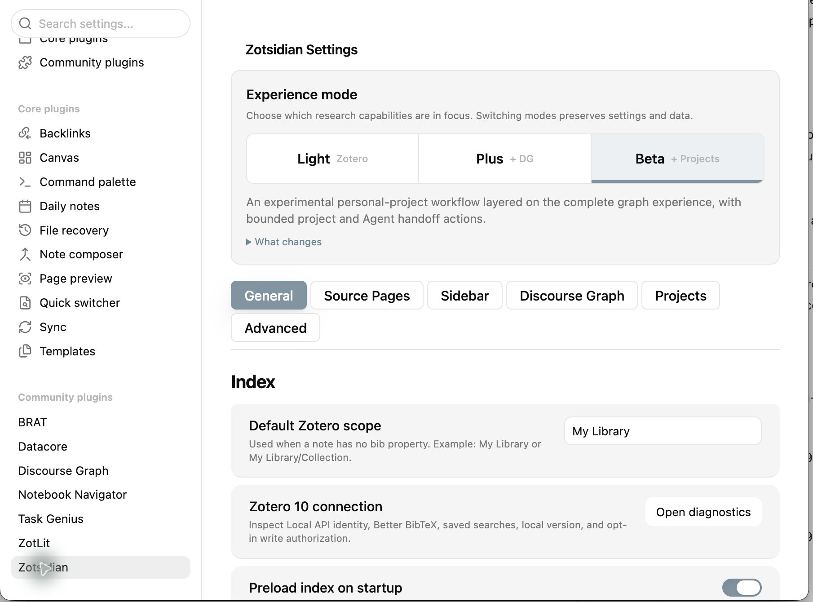
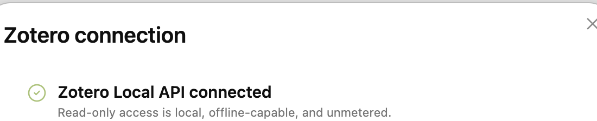
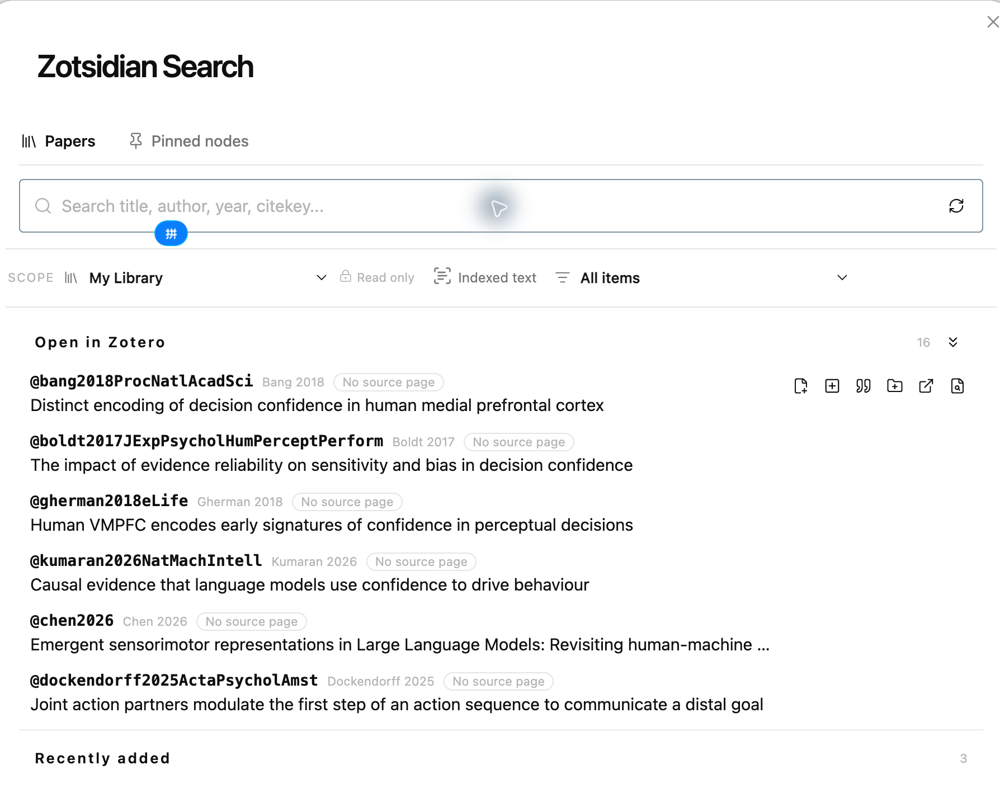
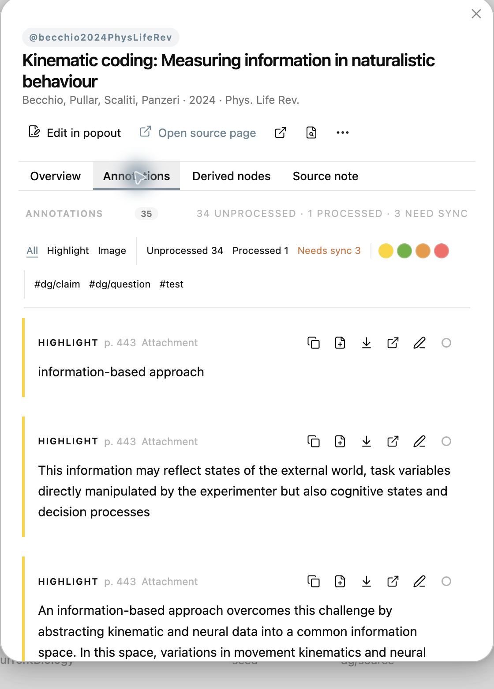
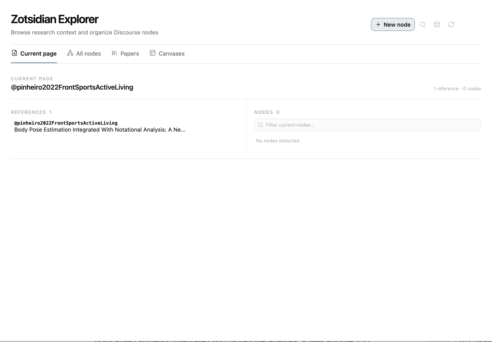
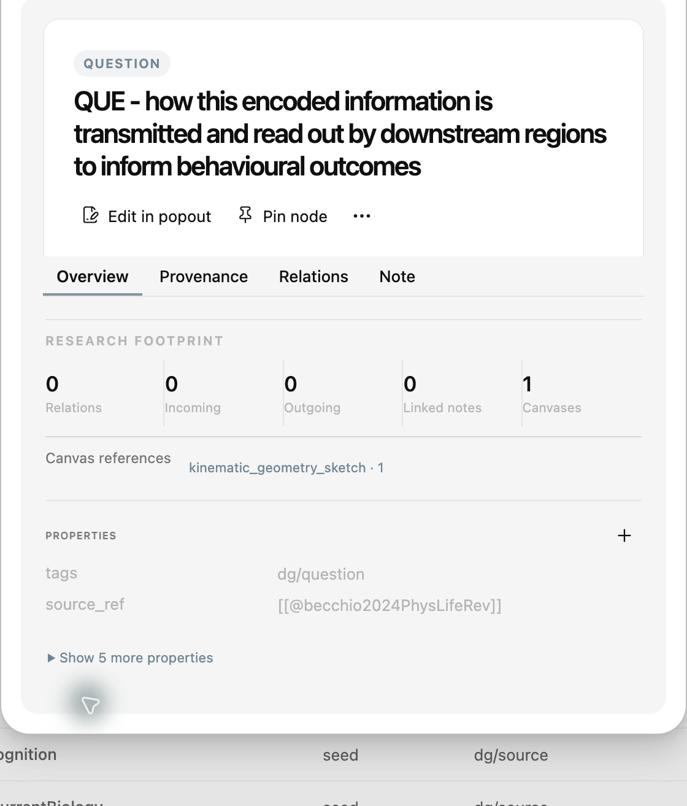
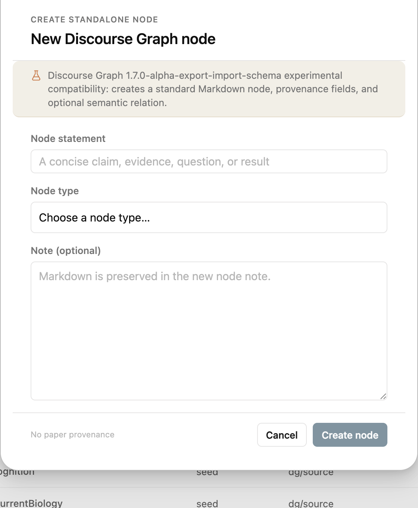
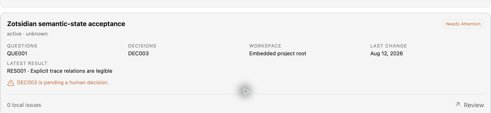
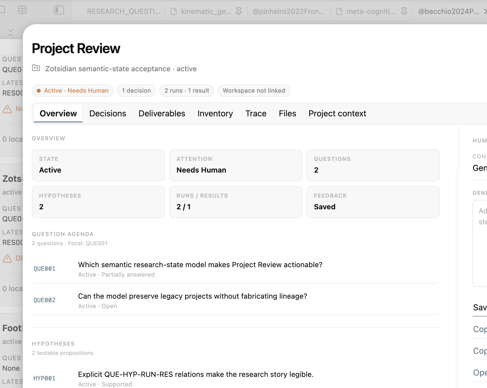

# Zotsidian 0.2.0 使用教程

Zotsidian 把 Zotero 中的论文、附件和批注带入 Obsidian，并让它们继续进入
source page、研究节点、Canvas 和项目回顾。你不需要一次采用全部功能：从
Light 开始即可获得完整的 Zotero → Obsidian 工作流，Plus 和 Beta 是按需增加
的研究组织层。

> [!tip] 最短上手路径
> 启动 Zotero → 打开 Zotsidian Search → 插入引用 → 打开 References →
> 创建 source page → 在 Paper Inspector 中查看批注。

## 1. 先选择适合你的模式

模式用于聚焦功能，并不是付费等级。切换模式不会删除详细设置或研究数据。



| 模式 | 适合谁 | 增加的能力 |
| --- | --- | --- |
| **Light** | 希望在 Obsidian 中顺畅使用 Zotero 的所有用户 | 搜索、引用、References、source page、annotation、Paper Inspector、Papers |
| **Plus** | 需要把阅读内容提炼成结构化研究节点的用户 | Light + DG nodes、Explorer、Node Inspector、Composer、Canvas |
| **Beta** | 需要持续维护研究项目与人机协作状态的高级用户 | Plus + Project Manager、Project Review、Trace、反馈和 Agent handoff |

第一次安装建议选择 **Light**。等你确实需要节点或项目功能时再升级模式。

## 2. 安装与首次连接

### 前置条件

- Obsidian Desktop `>= 1.10.6`
- Zotero Desktop 10；Zotero 8 保留只读兼容路径
- 稳定的 citation key；多数用户应安装 Better BibTeX
- Zotero 与 Obsidian 在同一台电脑上运行

在 Zotero 的 `Settings / Preferences → Advanced` 中启用：

> Allow other applications on this computer to communicate with Zotero

### 安装插件

在尚未进入 Obsidian Community Plugins 目录前：

1. 下载 Zotsidian Release 中的 `main.js`、`manifest.json` 和 `styles.css`。
2. 在 Vault 中建立 `.obsidian/plugins/zotsidian/`。
3. 把三个文件放入该目录。
4. 在 Obsidian 的 Community plugins 中启用 **Zotsidian**。

进入 `Settings → Zotsidian`，点击 **Open diagnostics**。看到以下状态，说明本地
读取链路已建立：



> [!note] 写入是另一层授权
> 文献检索、附件读取和批注加载走本机只读链路。Zotero 10 的 tag、collection
> 或 annotation 写入需要单独、明确授权；Zotsidian 不会因为只读连接成功就自动
> 修改 Zotero 数据。

## 3. Light：完成第一次 Zotero → Obsidian 工作流

### 3.1 搜索论文

使用快捷键：

- macOS：<kbd>Cmd</kbd> + <kbd>Shift</kbd> + <kbd>U</kbd>
- Windows/Linux：<kbd>Ctrl</kbd> + <kbd>Shift</kbd> + <kbd>U</kbd>

也可以在命令面板运行 `Zotsidian: Open Zotsidian Search`。

搜索面板打开时，会优先显示 Zotero 当前打开的论文和最近加入的条目，因此即使
不输入查询也有可操作内容。



输入标题、作者、年份或 citekey 后，每一行都提供紧邻的常用动作：加入当前笔记、
插入 citation、创建 source page、打开 Zotero，以及打开 PDF/附件。


<video controls muted playsinline width="100%">
  <source src="tutorial/assets/V01-light-search-filter.mp4" type="video/mp4">
</video>

[如果播放器没有显示，可直接打开 10 秒搜索演示](tutorial/assets/V01-light-search-filter.mp4)。

### 3.2 插入引用

Zotsidian 有两种主要引用入口：

1. 在编辑器中输入 `@`，继续输入作者、题名或 citekey；
2. 在 Search 中点击论文行的引用按钮。

引用输出可配置为：

- `[@citekey]`
- `@citekey`
- `[[@citekey]]`

默认推荐 `[@citekey]`，因为它既适合 Pandoc 风格写作，也能被 References 稳定识别。

### 3.3 用 References 回看当前笔记

References 会读取当前普通笔记中的正式引用。数字按钮表示 citekey 在正文中的
出现位置，点击即可回到对应段落。


你可以：

- 按插入顺序、年份或作者排序；
- 点击 citekey 打开或创建 source page；
- 点击论文题名跳转到 Zotero；
- 从右侧面板继续打开 Search 或最近文献。

如果关闭了 Sidebar，可点击左侧 ribbon 的书本图标，或运行
`Zotsidian: Open References sidebar` 重新打开。

### 3.4 建立 source page

source page 是以 `@citekey` 命名的普通 Markdown 笔记。它不是另一份文献数据库，
而是 Zotero 论文在 Obsidian 中的长期入口。

进入 source page 后，右侧 Sidebar 会显示：

- 论文题名、期刊、年份和 DOI；
- Zotero item、PDF 与其他附件；
- Zotero annotations；
- references、citations 与相关文献；
- 与论文相连的研究节点。


Zotero 刷新只更新 Zotsidian 管理的内容块；你写在管理区之外的 Markdown 会保留。

### 3.5 使用 Paper Inspector

在 Search、References 或 source page 中打开 Paper Inspector，可以在一个较小的
浮动窗口里查看论文覆盖情况，而不打断当前写作。


Overview 会汇总：

- source page 是否存在；
- annotation 数量；
- derived nodes 数量；
- Canvas footprint；
- 核心论文元数据。

切换到 **Annotations** 后，可以按类型、处理状态、颜色和 tag 过滤批注。



每条 annotation 都可以复制、加入 source page、插入当前笔记、回到 Zotero，或编辑
comment/tag。Plus 模式下还可以把 annotation 提炼成 Question、Claim、Evidence
等研究节点。

> [!success] 到这里，Light 工作流已经完整
> 你已经能从 Zotero 找论文、插入引用、从 References 回到上下文、建立长期
> source page，并在不离开 Obsidian 的情况下处理批注。若你不需要图谱和项目管理，
> 可以一直停留在 Light。

## 4. Plus：把阅读转成研究节点

Plus 在 Light 之上增加 Discourse Graph 能力。它不改变 Zotero 是文献与批注事实
来源这一原则，而是让 Obsidian 管理你的问题、论断、证据和综合结果。

### 4.1 Explorer：先看当前上下文

使用 ribbon 的 Explorer 图标，或运行
`Zotsidian: Open Zotsidian Explorer`。Current page 会把当前笔记中的论文和节点
放在同一个上下文里。



在 **All nodes** 中，可以按题名、类型、tag、状态和关键字检索整个节点目录，并切换
视图、列和分组。


### 4.2 Node Inspector

点击 Explorer 中的节点可以打开 Node Inspector。它显示节点属性、来源、关系、
被哪些笔记引用，以及出现在哪些 Canvas。



Node Inspector 适合快速判断“这个节点是什么、从哪里来、有没有被使用”；真正的
长文本编辑仍然在原生 Markdown 页面完成。

### 4.3 创建节点

Explorer 的 **New node** 打开 Composer。填写一句可独立理解的 statement，选择
Question、Claim、Evidence、Result 等类型，并按需加入说明。



从 annotation 创建节点时，Zotsidian 会保留论文和批注来源；standalone node
则明确显示没有 paper provenance。不要为了填满图谱而创建节点，优先保留能够在
未来写作中被重新理解和引用的陈述。

### 4.4 在 Discourse Canvas 中综合

如果安装了 `discourse-graphs`，References Sidebar 能识别 Canvas 上的 source
和 discourse nodes，跟随选择高亮，并从侧边栏反向定位节点。


一个实用的 Canvas 顺序是：

1. 放入相关 Source；
2. 加入 Question；
3. 把 Evidence 与 Claim 放在问题附近；
4. 只记录确实存在的关系；
5. 将形成的综合结论写成 Result 或新的 Claim。

原生 Obsidian Canvas 和 Base 也可以提取引用，但完整的双向节点体验主要面向
`discourse-graphs`。

> [!success] Plus 的完成标志
> 你不只是保存了论文，而是能看见“哪条证据支持哪项论断、它们在哪个 Canvas 被
> 使用”。这是 Zotsidian 与一般引用插件差异最大的部分。

## 5. Beta：维护持续演化的研究项目

Beta 是实验性的高级模式。它读取 Markdown-native project capsule，将 Question、
Hypothesis、Decision、Run、Result、文件和 Agent handoff 组织成可回顾的项目状态。

### 5.1 Project Manager

`Zotsidian: Open Project Manager` 会发现配置目录中包含 `PROJECT.md` 的项目。
List、Board 和 Roadmap 使用同一个项目模型；Roadmap 只展示已记录事实，不会猜测
截止日期或依赖。



每张卡片聚合状态、焦点问题、待决策项、工作区、最近变更和最新 Result。它是项目
入口，而不是新的数据库。

### 5.2 Project Review

Project Review 是单项目控制室。它优先回答：

- 项目现在处于什么状态？
- 什么需要人处理？
- 当前 Question 和 Hypothesis 是什么？
- 哪些 Run 已经执行？
- 哪些 Result 等待审阅或提升？


Overview 适合日常回顾；Decisions、Deliverables、Inventory、Files 与 Project
context 用于进一步核查。权威内容始终保存在项目 Markdown 文件中。

### 5.3 Trace：检查证据链，而不是生成装饰图

Trace 只显示明确记录的关系，例如：

```text
Question → Hypothesis → Run → Result
```

点击节点会在右侧预览对应 Markdown；点击连线会显示该关系的来源证据。没有记录的
关系不会因为对象同时出现就被推断出来。


### 5.4 Human feedback 与 Agent handoff

打开 **Human feedback** 可以保存给下一轮研究工作的反馈，也可以复制一个带有项目
上下文、读取顺序、待决策项和允许写入范围的 handoff。



保存只会修改项目 `REVIEW.md` 中由 Zotsidian 管理的区块，不会改写
`PROJECT.md` 或管理区外的人工内容。Copy & open 负责复制并导航，不等于已经启动
或授权 Agent。

> [!warning] Beta 的边界
> Project Review 是人机协作的检查点，不是自治执行器。确认 Decision、审查 Result
> 和决定允许写入的范围仍然属于人。

## 6. 推荐的渐进采用方式

### 第 1 周：只用 Light

- 在真实写作中使用 `@` 和 Search。
- 保持 References 打开。
- 只为重要论文建立 source page。
- 用 Paper Inspector 处理 annotation。

### 第 2 周：在一个主题上试用 Plus

- 每篇论文只提炼少量高价值 Question、Claim、Evidence。
- 在一个 Canvas 上组织这些节点。
- 使用 Inspector 检查来源和复用位置。

### 第 3 周以后：有持续项目时再用 Beta

- 为项目建立规范的 `PROJECT.md` capsule。
- 明确 Question、Decision、Run 和 Result。
- 用 Trace 检查关系缺口。
- 在交给 Agent 前先写 Human feedback，并审查 handoff。

## 7. 常见问题

### Search 没有结果

确认 Zotero 正在运行、本地通信已允许、目标条目存在于当前 scope，并且有 citation
key。然后打开 connection diagnostics。

### 关闭 References 后找不到

点击左侧 ribbon 的书本图标，或运行
`Zotsidian: Open References sidebar`。

### 为什么有的论文不能打开 PDF？

论文需要在本地 Zotero 中有可访问的 PDF attachment。只有 DOI 或网页记录并不足以
提供本地 PDF。

### 刷新 source page 会覆盖我的笔记吗？

Zotsidian 只维护其管理区块。人工内容应写在管理区之外；批注刷新设计为幂等操作。

### 为什么 Light 看不到节点或项目？

这是模式边界，不是数据丢失。切换到 Plus 或 Beta 后功能会恢复，已有设置和数据
不会被删除。

### Zotero 关闭时会怎样？

实时检索、PDF、附件和 annotation 功能会降级。Zotsidian 不应在来源不可用时进行
破坏性的 source-note 写入。

## 8. 一页工作流速查

```text
Light
Zotero → Search / @ → Citation → References → Source page → Annotation

Plus
Light → Question / Claim / Evidence → Explorer / Inspector → Canvas

Beta
Plus → Project Manager → Project Review → Decision / Run / Result → Trace
     → Human feedback → Reviewed Agent handoff
```

> [!tip] 选择原则
> 如果一个功能没有解决你当前研究中的真实摩擦，就暂时不要开启更高模式。
> Zotsidian 的目标是让研究上下文连续，而不是要求每位用户维护同样复杂的系统。
